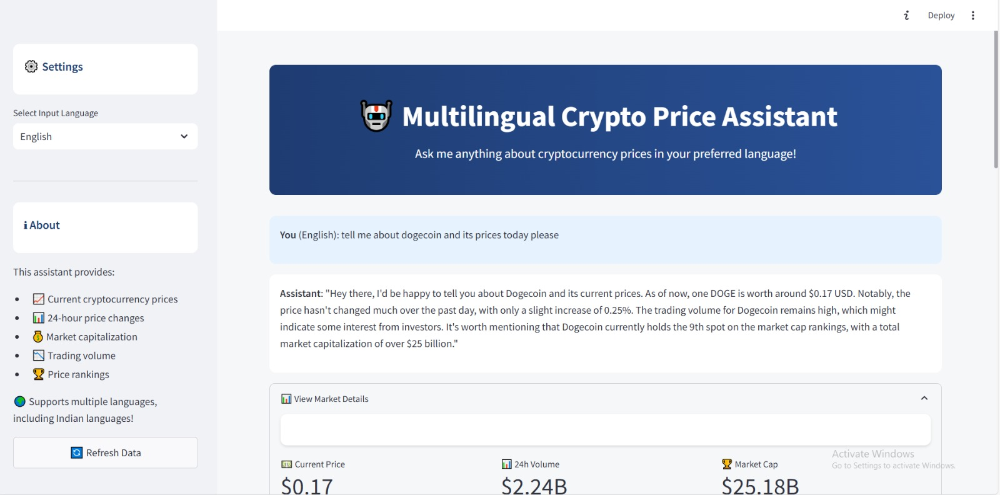
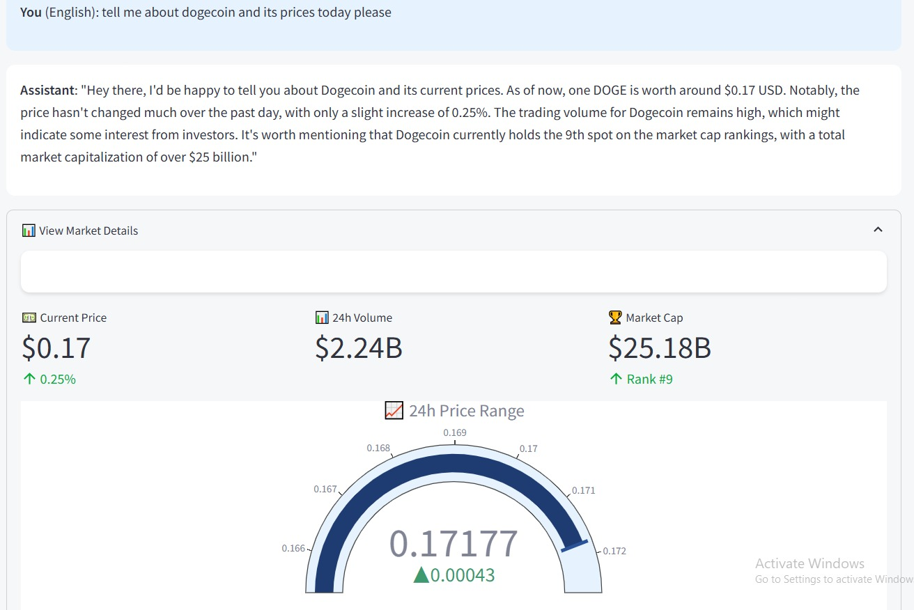

# 💰 Multilingual Crypto Price Assistant


A Streamlit-based multilingual cryptocurrency price assistant that provides up-to-date crypto information, including current price, 24-hour changes, market capitalization, and trading volume in multiple languages, including Indian languages.

---

## 📑 Table of Contents
1. [Introduction](#introduction)
2. [Features](#features)
3. [Prompt Engineering Approach](#prompt-engineering-approach)
4. [Setup Instructions](#setup-instructions)
5. [Assumptions and Limitations](#assumptions-and-limitations)

---

## 📘 Introduction
The **Multilingual Crypto Price Assistant** is an interactive web app that enables users to query cryptocurrency prices in their preferred language. Powered by Streamlit and Plotly, this assistant delivers real-time data on cryptocurrencies with a visually engaging and multilingual interface.

The assistant supports:
- 🌍 Multiple languages, including major Indian languages.
- 📈 Crypto data including current price, 24-hour change, market cap, and trading volume.
- 🏆 Rankings and price trends over the last 24 hours.

---

## ✨ Features
- **Multilingual Support**: Ask questions in various languages, including Hindi, Tamil, and Bengali, with natural language responses.
- **Real-Time Cryptocurrency Data**: Retrieve current price, 24-hour changes, and market rankings.
- **Interactive UI**: Expanding sections and interactive charts to display market trends in a user-friendly way.
- **Dynamic Refresh**: One-click button to refresh crypto data with up-to-date information.

---

## 🎛️ Prompt Engineering Approach
This assistant leverages prompt engineering to deliver relevant and concise responses. The approach includes:
1. **Keyword Matching**: For each user query, the assistant searches for crypto symbols or names within the response to identify relevant data.
2. **Structured Response Formatting**: Responses are formatted with metric summaries, such as 24-hour price changes and market cap, in a user-friendly style.
3. **Enhanced Chart Integration**: Custom visuals using Plotly are generated dynamically for each cryptocurrency, providing a clear representation of 24-hour price trends.

---
## 🛠️ Setup Instructions

### Prerequisites
- Python 3.7 or higher
- API Key for cryptocurrency data (e.g., from CoinGecko, CoinMarketCap, etc.)

### Installation

1. **Clone the repository**:
  ```bash
  git clone https://github.com/your-username/multilingual-crypto-assistant.git
  cd multilingual-crypto-assistant
  ```

2. **Set up a virtual environment** (optional but recommended):
  ```bash
  python3 -m venv venv
  source venv/bin/activate   # On Windows: venv\Scripts\activate
  ```

3. **Install dependencies**:
  ```bash
  pip install -r requirements.txt
  ```

4. **Set up environment variables**:
 - Create a `.env` file in the root directory.
 - Add your API key and any other necessary environment variables:
   ```plaintext
   API_KEY=your_api_key_here
   ```

5. **Run the app**:
  ```bash
  streamlit run agent.py
  ```

6. **Access the application**:
 - Open your browser and go to `http://localhost:8501`.

---

## 🧩 Assumptions and Limitations
1. **API Limitations**: Real-time data retrieval is dependent on the limits of the cryptocurrency API (e.g., rate limits).
2. **Language Support**: The assistant can only respond in supported languages; some complex language-specific queries may result in incomplete answers.
3. **Data Refresh Lag**: The "Refresh Data" button may take a few seconds to update due to API response times.
4. **Limited Cryptocurrency Symbols**: The assistant recognizes popular crypto symbols, but less common tokens may not be supported.

---

## 📷 Screenshots

### Main Interface


### Market Details Example


---

## ✉️ Contact
For any questions or feedback, please contact [vamsidhar.venkataraman@gmail.com](mailto:vamsidhar.venkataraman@gmail.com).

---

Enjoy using the **Multilingual Crypto Price Assistant** to stay informed on the latest crypto market trends in your preferred language!
